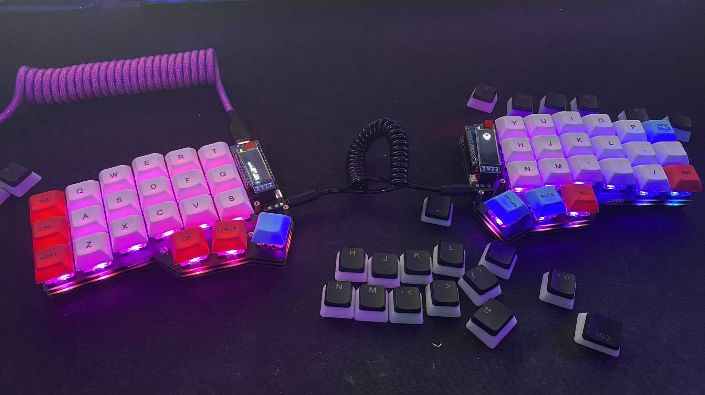

# Corne Keyboard

This is my custom Keymaps for my corne keyboard.

## Requirements

- [QMK](https://qmk.fm/)
- [QMK MSYS](https://msys.qmk.fm/)
- [QMK Toolbox](https://github.com/qmk/qmk_toolbox)
- [VIA (Optional)](https://caniusevia.com/)

## Usage 

Clone inside of:

 ```
 keyboards/crkbd/keymaps/
 ```

 Then run this command in your QMK SYS console:

 ```
qmk compile -kb crkbd/rev1 -km tavobarrientos
 ```

 ## Flashing the Keyboard
 Use the tool named QMK Toolbox to flash the microcontrollers, remember, if you are using a Corne Keyboard, or a 
 splitted keyboard with two microcontrollers, flash both to update firmware.

 ## Add Via Support

Append to the file rules.mk the following line:

```
VIA_ENABLE = yes
```

